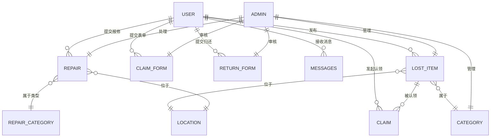

# 校园失物招领与位置追踪系统 - 数据库文档

## 一、数据库概述

本系统使用 **MySQL** 作为数据库管理系统，数据库名为 `compus`，用户名为 `mapuser`，密码为 `123456`。

### 数据库连接信息
- **主机**: localhost
- **端口**: 3306（默认）
- **数据库名**: compus
- **用户名**: mapuser
- **密码**: 123456
- **字符集**: utf8mb4

## 二、数据库表结构

### 2.1 用户表（user）

**功能描述**：存储系统用户信息

| 字段名 | 类型 | 约束 | 说明 |
| :--- | :--- | :--- | :--- |
| user_id | INT | PRIMARY KEY, AUTO_INCREMENT | 用户唯一标识 |
| username | VARCHAR(50) | UNIQUE, NOT NULL | 用户名 |
| password_hash | VARCHAR(255) | NOT NULL | 密码哈希值 |
| email | VARCHAR(100) | UNIQUE | 用户邮箱 |
| phone | VARCHAR(20) | - | 用户手机号 |
| avatar_url | VARCHAR(500) | - | 头像URL |
| bg_image | VARCHAR(500) | - | 背景图片URL |
| signature | VARCHAR(255) | - | 个性签名 |
| bio | TEXT | - | 用户简介 |
| create_time | DATETIME | DEFAULT CURRENT_TIMESTAMP | 创建时间 |

**索引**：
- PRIMARY KEY: user_id
- UNIQUE: username, email

**建表语句**：
```sql
CREATE TABLE IF NOT EXISTS user (
    user_id INT AUTO_INCREMENT PRIMARY KEY,
    username VARCHAR(50) NOT NULL UNIQUE,
    password_hash VARCHAR(255) NOT NULL,
    email VARCHAR(100) UNIQUE,
    phone VARCHAR(20),
    avatar_url VARCHAR(500),
    bg_image VARCHAR(500),
    signature VARCHAR(255),
    bio TEXT,
    create_time DATETIME DEFAULT CURRENT_TIMESTAMP,
    INDEX idx_user_username (username),
    INDEX idx_user_email (email)
) ENGINE=InnoDB DEFAULT CHARSET=utf8mb4 COLLATE=utf8mb4_unicode_ci;
```

---

### 2.2 管理员表（admin）

**功能描述**：存储系统管理员信息

| 字段名 | 类型 | 约束 | 说明 |
| :--- | :--- | :--- | :--- |
| admin_id | INT | PRIMARY KEY, AUTO_INCREMENT | 管理员唯一标识 |
| username | VARCHAR(50) | UNIQUE, NOT NULL | 管理员用户名 |
| password_hash | VARCHAR(255) | NOT NULL | 密码哈希值 |

**索引**：
- PRIMARY KEY: admin_id
- UNIQUE: username

**建表语句**：
```sql
CREATE TABLE IF NOT EXISTS admin (
    admin_id INT AUTO_INCREMENT PRIMARY KEY,
    username VARCHAR(50) NOT NULL UNIQUE,
    password_hash VARCHAR(255) NOT NULL,
    INDEX idx_admin_username (username)
) ENGINE=InnoDB DEFAULT CHARSET=utf8mb4 COLLATE=utf8mb4_unicode_ci;
```

---

### 2.3 失物招领物品表（lost_item）

**功能描述**：存储丢失/拾到物品的信息

| 字段名 | 类型 | 约束 | 说明 |
| :--- | :--- | :--- | :--- |
| item_id | INT | PRIMARY KEY, AUTO_INCREMENT | 物品唯一标识 |
| title | VARCHAR(100) | NOT NULL | 物品标题 |
| description | TEXT | - | 物品描述 |
| type | SMALLINT | - | 类型：0=丢失，1=拾到 |
| category_id | INT | - | 分类ID（外键关联category表） |
| status | SMALLINT | - | 状态：0=待认领，1=已认领，2=已关闭 |
| image_urls | TEXT | - | 图片URL列表（JSON格式） |
| publisher_id | INT | NOT NULL | 发布者用户ID（外键关联user表） |
| location_id | INT | - | 位置ID（外键关联location表） |
| create_time | DATETIME | DEFAULT CURRENT_TIMESTAMP | 创建时间 |
| update_time | DATETIME | DEFAULT CURRENT_TIMESTAMP ON UPDATE CURRENT_TIMESTAMP | 更新时间 |

**索引**：
- PRIMARY KEY: item_id
- FOREIGN KEY: publisher_id → user(user_id)
- FOREIGN KEY: category_id → category(category_id)
- FOREIGN KEY: location_id → location(location_id)

**建表语句**：
```sql
CREATE TABLE IF NOT EXISTS lost_item (
    item_id INT AUTO_INCREMENT PRIMARY KEY,
    title VARCHAR(100) NOT NULL,
    description TEXT,
    type SMALLINT,
    category_id INT,
    status SMALLINT,
    image_urls TEXT,
    publisher_id INT NOT NULL,
    location_id INT,
    create_time DATETIME DEFAULT CURRENT_TIMESTAMP,
    update_time DATETIME DEFAULT CURRENT_TIMESTAMP ON UPDATE CURRENT_TIMESTAMP,
    INDEX idx_lostitem_publisher (publisher_id),
    INDEX idx_lostitem_category (category_id),
    INDEX idx_lostitem_location (location_id),
    INDEX idx_lostitem_status (status),
    FOREIGN KEY (publisher_id) REFERENCES user(user_id) ON DELETE CASCADE,
    FOREIGN KEY (category_id) REFERENCES category(category_id) ON DELETE SET NULL,
    FOREIGN KEY (location_id) REFERENCES location(location_id) ON DELETE SET NULL
) ENGINE=InnoDB DEFAULT CHARSET=utf8mb4 COLLATE=utf8mb4_unicode_ci;
```

---

### 2.4 位置表（location）

**功能描述**：存储物品所在位置信息

| 字段名 | 类型 | 约束 | 说明 |
| :--- | :--- | :--- | :--- |
| location_id | INT | PRIMARY KEY, AUTO_INCREMENT | 位置唯一标识 |
| name | VARCHAR(200) | NOT NULL | 位置名称 |
| latitude | NUMERIC(10,8) | - | 纬度 |
| longitude | NUMERIC(11,8) | - | 经度 |
| detail | VARCHAR(500) | - | 详细描述 |

**索引**：
- PRIMARY KEY: location_id

**建表语句**：
```sql
CREATE TABLE IF NOT EXISTS location (
    location_id INT AUTO_INCREMENT PRIMARY KEY,
    name VARCHAR(200) NOT NULL,
    latitude NUMERIC(10,8),
    longitude NUMERIC(11,8),
    detail VARCHAR(500),
    INDEX idx_location_coords (latitude, longitude)
) ENGINE=InnoDB DEFAULT CHARSET=utf8mb4 COLLATE=utf8mb4_unicode_ci;
```

---

### 2.5 分类表（category）

**功能描述**：存储物品分类信息

| 字段名 | 类型 | 约束 | 说明 |
| :--- | :--- | :--- | :--- |
| category_id | INT | PRIMARY KEY, AUTO_INCREMENT | 分类唯一标识 |
| name | VARCHAR(50) | NOT NULL | 分类名称 |

**索引**：
- PRIMARY KEY: category_id

**默认分类数据**（系统初始化时自动创建）：
1. 校园卡
2. 钥匙
3. 书包
4. 手机
5. 钱包
6. 证件
7. 文具
8. 其他

**建表语句**：
```sql
CREATE TABLE IF NOT EXISTS category (
    category_id INT AUTO_INCREMENT PRIMARY KEY,
    name VARCHAR(50) NOT NULL,
    UNIQUE KEY idx_category_name (name)
) ENGINE=InnoDB DEFAULT CHARSET=utf8mb4 COLLATE=utf8mb4_unicode_ci;
```

---

### 2.6 认领申请表（claim）

**功能描述**：存储物品认领申请记录

| 字段名 | 类型 | 约束 | 说明 |
| :--- | :--- | :--- | :--- |
| claim_id | INT | PRIMARY KEY, AUTO_INCREMENT | 认领申请唯一标识 |
| item_id | INT | NOT NULL | 物品ID（外键关联lost_item表） |
| claimer_id | INT | NOT NULL | 认领人用户ID（外键关联user表） |
| message | TEXT | - | 认领留言 |
| status | SMALLINT | - | 状态：0=待确认，1=已确认，2=已拒绝 |
| create_time | DATETIME | DEFAULT CURRENT_TIMESTAMP | 创建时间 |

**索引**：
- PRIMARY KEY: claim_id
- FOREIGN KEY: item_id → lost_item(item_id)
- FOREIGN KEY: claimer_id → user(user_id)

**建表语句**：
```sql
CREATE TABLE IF NOT EXISTS claim (
    claim_id INT AUTO_INCREMENT PRIMARY KEY,
    item_id INT NOT NULL,
    claimer_id INT NOT NULL,
    message TEXT,
    status SMALLINT DEFAULT 0,
    create_time DATETIME DEFAULT CURRENT_TIMESTAMP,
    INDEX idx_claim_item (item_id),
    INDEX idx_claim_claimer (claimer_id),
    INDEX idx_claim_status (status),
    FOREIGN KEY (item_id) REFERENCES lost_item(item_id) ON DELETE CASCADE,
    FOREIGN KEY (claimer_id) REFERENCES user(user_id) ON DELETE CASCADE
) ENGINE=InnoDB DEFAULT CHARSET=utf8mb4 COLLATE=utf8mb4_unicode_ci;
```

---

### 2.7 认领表单表（claim_form）

**功能描述**：存储详细的认领申请表单信息

| 字段名 | 类型 | 约束 | 说明 |
| :--- | :--- | :--- | :--- |
| claim_id | INT | PRIMARY KEY, AUTO_INCREMENT | 表单唯一标识 |
| item_id | INT | - | 物品ID |
| username | VARCHAR(50) | - | 用户名 |
| applicant_name | VARCHAR(100) | - | 申请人姓名 |
| applicant_phone | VARCHAR(50) | NOT NULL | 申请人手机号 |
| claim_reason | TEXT | NOT NULL | 认领理由 |
| item_description | TEXT | NOT NULL | 物品描述 |
| user_id | INT | - | 用户ID |
| proof_images | TEXT | - | 证明图片URL列表（JSON格式） |
| status | SMALLINT | DEFAULT 0 | 状态：0=待审核，1=已通过，2=已拒绝 |
| create_time | DATETIME | DEFAULT CURRENT_TIMESTAMP | 创建时间 |

**索引**：
- PRIMARY KEY: claim_id

**建表语句**：
```sql
CREATE TABLE IF NOT EXISTS claim_form (
    claim_id INT AUTO_INCREMENT PRIMARY KEY,
    item_id INT,
    username VARCHAR(50),
    applicant_name VARCHAR(100),
    applicant_phone VARCHAR(50) NOT NULL,
    claim_reason TEXT NOT NULL,
    item_description TEXT NOT NULL,
    user_id INT,
    proof_images TEXT,
    status SMALLINT DEFAULT 0,
    create_time DATETIME DEFAULT CURRENT_TIMESTAMP,
    INDEX idx_claimform_item (item_id),
    INDEX idx_claimform_user (user_id),
    INDEX idx_claimform_status (status)
) ENGINE=InnoDB DEFAULT CHARSET=utf8mb4 COLLATE=utf8mb4_unicode_ci;
```

---

### 2.8 归还表单表（return_form）

**功能描述**：存储详细的归还申请表单信息

| 字段名 | 类型 | 约束 | 说明 |
| :--- | :--- | :--- | :--- |
| return_id | INT | PRIMARY KEY, AUTO_INCREMENT | 表单唯一标识 |
| item_id | INT | - | 物品ID |
| username | VARCHAR(50) | - | 用户名 |
| applicant_name | VARCHAR(100) | - | 申请人姓名 |
| applicant_phone | VARCHAR(50) | NOT NULL | 申请人手机号 |
| return_reason | TEXT | NOT NULL | 归还理由 |
| item_description | TEXT | NOT NULL | 物品描述 |
| user_id | INT | - | 用户ID |
| proof_images | TEXT | - | 证明图片URL列表（JSON格式） |
| status | SMALLINT | DEFAULT 0 | 状态：0=待审核，1=已通过，2=已拒绝 |
| create_time | DATETIME | DEFAULT CURRENT_TIMESTAMP | 创建时间 |

**索引**：
- PRIMARY KEY: return_id

**建表语句**：
```sql
CREATE TABLE IF NOT EXISTS return_form (
    return_id INT AUTO_INCREMENT PRIMARY KEY,
    item_id INT,
    username VARCHAR(50),
    applicant_name VARCHAR(100),
    applicant_phone VARCHAR(50) NOT NULL,
    return_reason TEXT NOT NULL,
    item_description TEXT NOT NULL,
    user_id INT,
    proof_images TEXT,
    status SMALLINT DEFAULT 0,
    create_time DATETIME DEFAULT CURRENT_TIMESTAMP,
    INDEX idx_returnform_item (item_id),
    INDEX idx_returnform_user (user_id),
    INDEX idx_returnform_status (status)
) ENGINE=InnoDB DEFAULT CHARSET=utf8mb4 COLLATE=utf8mb4_unicode_ci;
```

---

### 2.9 消息表（messages）

**功能描述**：存储系统消息通知

| 字段名 | 类型 | 约束 | 说明 |
| :--- | :--- | :--- | :--- |
| message_id | INT | PRIMARY KEY, AUTO_INCREMENT | 消息唯一标识 |
| user_id | INT | NOT NULL | 接收消息的用户ID（外键关联user表） |
| title | VARCHAR(255) | NOT NULL | 消息标题 |
| content | TEXT | NOT NULL | 消息内容 |
| message_type | ENUM | DEFAULT 'system' | 消息类型：system, claim, publish, reminder, return |
| is_read | BOOLEAN | DEFAULT FALSE | 是否已读 |
| is_deleted | BOOLEAN | DEFAULT FALSE | 是否删除（软删除） |
| delete_time | DATETIME | NULL | 删除时间 |
| create_time | DATETIME | DEFAULT CURRENT_TIMESTAMP | 创建时间 |

**索引**：
- PRIMARY KEY: message_id
- FOREIGN KEY: user_id → user(user_id)

**建表语句**：
```sql
CREATE TABLE IF NOT EXISTS messages (
    message_id INT AUTO_INCREMENT PRIMARY KEY,
    user_id INT NOT NULL,
    title VARCHAR(255) NOT NULL,
    content TEXT NOT NULL,
    message_type ENUM('system', 'claim', 'publish', 'reminder', 'return') DEFAULT 'system',
    is_read BOOLEAN DEFAULT FALSE,
    is_deleted BOOLEAN DEFAULT FALSE,
    delete_time DATETIME NULL,
    create_time DATETIME DEFAULT CURRENT_TIMESTAMP,
    INDEX idx_messages_user (user_id),
    INDEX idx_messages_read (is_read),
    FOREIGN KEY (user_id) REFERENCES user(user_id) ON DELETE CASCADE
) ENGINE=InnoDB DEFAULT CHARSET=utf8mb4 COLLATE=utf8mb4_unicode_ci;
```

---

### 2.10 地图配置表（map_config）

**功能描述**：存储地图默认配置信息

| 字段名 | 类型 | 约束 | 说明 |
| :--- | :--- | :--- | :--- |
| id | INT | PRIMARY KEY, AUTO_INCREMENT | 配置唯一标识 |
| name | VARCHAR(50) | UNIQUE | 配置名称 |
| center_lng | DECIMAL(11,8) | - | 默认中心点经度 |
| center_lat | DECIMAL(10,8) | - | 默认中心点纬度 |
| sw_lng | DECIMAL(11,8) | - | 西南角经度（边界） |
| sw_lat | DECIMAL(10,8) | - | 西南角纬度（边界） |
| ne_lng | DECIMAL(11,8) | - | 东北角经度（边界） |
| ne_lat | DECIMAL(10,8) | - | 东北角纬度（边界） |
| zoom | INT | - | 默认缩放级别 |

**索引**：
- PRIMARY KEY: id
- UNIQUE: name

**建表语句**：
```sql
CREATE TABLE IF NOT EXISTS map_config (
    id INT AUTO_INCREMENT PRIMARY KEY,
    name VARCHAR(50) UNIQUE,
    center_lng DECIMAL(11,8),
    center_lat DECIMAL(10,8),
    sw_lng DECIMAL(11,8),
    sw_lat DECIMAL(10,8),
    ne_lng DECIMAL(11,8),
    ne_lat DECIMAL(10,8),
    zoom INT,
    INDEX idx_mapconfig_name (name)
) ENGINE=InnoDB DEFAULT CHARSET=utf8mb4 COLLATE=utf8mb4_unicode_ci;
```

---

### 2.10 报修类型表（repair_category）

**功能描述**：存储报修类型分类信息

| 字段名 | 类型 | 约束 | 说明 |
| :--- | :--- | :--- | :--- |
| repair_category_id | INT | PRIMARY KEY, AUTO_INCREMENT | 报修类型唯一标识 |
| name | VARCHAR(50) | NOT NULL | 报修类型名称 |
| icon | VARCHAR(100) | - | 类型图标标识 |
| description | VARCHAR(200) | - | 类型描述 |

**索引**：
- PRIMARY KEY: repair_category_id

**预设报修类型**：
1. 基础设施 - 建筑设施维修
2. 电气设备 - 电器设备维修
3. 环境卫生 - 环境卫生问题
4. 其他 - 其他问题

**建表语句**：
```sql
CREATE TABLE IF NOT EXISTS repair_category (
    repair_category_id INT AUTO_INCREMENT PRIMARY KEY,
    name VARCHAR(50) NOT NULL,
    icon VARCHAR(100),
    description VARCHAR(200),
    UNIQUE KEY idx_repaircategory_name (name)
) ENGINE=InnoDB DEFAULT CHARSET=utf8mb4 COLLATE=utf8mb4_unicode_ci;
```

---

### 2.11 报修表（repair）

**功能描述**：存储报修申请记录

| 字段名 | 类型 | 约束 | 说明 |
| :--- | :--- | :--- | :--- |
| repair_id | INT | PRIMARY KEY, AUTO_INCREMENT | 报修单唯一标识 |
| title | VARCHAR(100) | NOT NULL | 报修标题 |
| description | TEXT | NOT NULL | 问题描述 |
| repair_category_id | INT | NOT NULL | 报修类型ID（外键关联repair_category表） |
| location_id | INT | - | 位置ID（外键关联location表） |
| reporter_id | INT | NOT NULL | 报修人用户ID（外键关联user表） |
| images | TEXT | - | 问题图片URL列表（JSON格式） |
| status | SMALLINT | DEFAULT 0 | 状态：0=待处理，1=处理中，2=已完成，3=已关闭 |
| priority | SMALLINT | DEFAULT 1 | 优先级：1=低，2=中，3=高 |
| assignee_id | INT | - | 处理人ID（外键关联admin表） |
| process_note | TEXT | - | 处理备注 |
| create_time | DATETIME | DEFAULT CURRENT_TIMESTAMP | 创建时间 |
| update_time | DATETIME | DEFAULT CURRENT_TIMESTAMP ON UPDATE CURRENT_TIMESTAMP | 更新时间 |

**索引**：
- PRIMARY KEY: repair_id
- FOREIGN KEY: repair_category_id → repair_category(repair_category_id)
- FOREIGN KEY: location_id → location(location_id)
- FOREIGN KEY: reporter_id → user(user_id)
- FOREIGN KEY: assignee_id → admin(admin_id)

**状态码说明**：
| 值 | 状态 | 说明 |
| :--- | :--- | :--- |
| 0 | 待处理 | 报修单已提交，等待处理 |
| 1 | 处理中 | 管理员已接单，正在处理 |
| 2 | 已完成 | 问题已解决 |
| 3 | 已关闭 | 报修单已关闭（未解决或取消） |

**优先级说明**：
| 值 | 优先级 | 说明 |
| :--- | :--- | :--- |
| 1 | 低 | 一般问题，可稍后处理 |
| 2 | 中 | 需要及时处理 |
| 3 | 高 | 紧急问题，需要立即处理 |

**建表语句**：
```sql
CREATE TABLE IF NOT EXISTS repair (
    repair_id INT AUTO_INCREMENT PRIMARY KEY,
    title VARCHAR(100) NOT NULL,
    description TEXT NOT NULL,
    repair_category_id INT NOT NULL,
    location_id INT,
    reporter_id INT NOT NULL,
    images TEXT,
    status SMALLINT DEFAULT 0,
    priority SMALLINT DEFAULT 1,
    assignee_id INT,
    process_note TEXT,
    create_time DATETIME DEFAULT CURRENT_TIMESTAMP,
    update_time DATETIME DEFAULT CURRENT_TIMESTAMP ON UPDATE CURRENT_TIMESTAMP,
    INDEX idx_repair_category (repair_category_id),
    INDEX idx_repair_location (location_id),
    INDEX idx_repair_reporter (reporter_id),
    INDEX idx_repair_status (status),
    INDEX idx_repair_priority (priority),
    INDEX idx_repair_assignee (assignee_id),
    FOREIGN KEY (repair_category_id) REFERENCES repair_category(repair_category_id) ON DELETE CASCADE,
    FOREIGN KEY (location_id) REFERENCES location(location_id) ON DELETE SET NULL,
    FOREIGN KEY (reporter_id) REFERENCES user(user_id) ON DELETE CASCADE,
    FOREIGN KEY (assignee_id) REFERENCES admin(admin_id) ON DELETE SET NULL
) ENGINE=InnoDB DEFAULT CHARSET=utf8mb4 COLLATE=utf8mb4_unicode_ci;
```

---

## 三、表关系图



## 四、数据字典

### 4.1 状态码定义

| 表名 | 字段 | 值 | 含义 |
| :--- | :--- | :--- | :--- |
| lost_item | status | 0 | 待认领 |
| lost_item | status | 1 | 已认领 |
| lost_item | status | 2 | 已关闭 |
| lost_item | type | 0 | 丢失物品 |
| lost_item | type | 1 | 拾到物品 |
| claim | status | 0 | 待确认 |
| claim | status | 1 | 已确认 |
| claim | status | 2 | 已拒绝 |
| claim_form | status | 0 | 待审核 |
| claim_form | status | 1 | 已通过 |
| claim_form | status | 2 | 已拒绝 |
| messages | message_type | system | 系统消息 |
| messages | message_type | claim | 认领消息 |
| messages | message_type | publish | 发布消息 |
| messages | message_type | reminder | 提醒消息 |
| messages | message_type | return | 归还消息 |
| return_form | status | 0 | 待审核 |
| return_form | status | 1 | 已通过 |
| return_form | status | 2 | 已拒绝 |
| repair | status | 0 | 待处理 |
| repair | status | 1 | 处理中 |
| repair | status | 2 | 已完成 |
| repair | status | 3 | 已关闭 |
| repair | priority | 1 | 低优先级 |
| repair | priority | 2 | 中优先级 |
| repair | priority | 3 | 高优先级 |

### 4.2 报修类型预设数据

| repair_category_id | name | description |
| :--- | :--- | :--- |
| 1 | 基础设施 | 建筑设施维修 |
| 2 | 电气设备 | 电器设备维修 |
| 3 | 环境卫生 | 环境卫生问题 |
| 4 | 其他 | 其他问题 |

## 五、数据库初始化

### 5.1 默认管理员账号
- **用户名**: admin
- **密码**: admin

### 5.2 初始化脚本
系统启动时会自动执行以下初始化：

1. **管理员账号初始化**（Start.py）
   - 如果 `admin` 表中不存在 `username='admin'` 的记录，则创建默认管理员

2. **分类数据初始化**（Start.py）
   - 如果 `category` 表为空，则插入8个默认分类

3. **消息表初始化**（init_messages.py）
   - 创建 `messages` 表

4. **报修类型初始化**（需新增脚本）
   - 如果 `repair_category` 表为空，则插入8个预设报修类型

### 5.3 初始化SQL脚本

```sql
-- 创建所有表
-- 按顺序创建，先创建无外键依赖的表

-- 1. 创建用户表
CREATE TABLE IF NOT EXISTS user (
    user_id INT AUTO_INCREMENT PRIMARY KEY,
    username VARCHAR(50) NOT NULL UNIQUE,
    password_hash VARCHAR(255) NOT NULL,
    email VARCHAR(100) UNIQUE,
    phone VARCHAR(20),
    avatar_url VARCHAR(500),
    bg_image VARCHAR(500),
    signature VARCHAR(255),
    bio TEXT,
    create_time DATETIME DEFAULT CURRENT_TIMESTAMP
) ENGINE=InnoDB DEFAULT CHARSET=utf8mb4 COLLATE=utf8mb4_unicode_ci;

-- 2. 创建管理员表
CREATE TABLE IF NOT EXISTS admin (
    admin_id INT AUTO_INCREMENT PRIMARY KEY,
    username VARCHAR(50) NOT NULL UNIQUE,
    password_hash VARCHAR(255) NOT NULL
) ENGINE=InnoDB DEFAULT CHARSET=utf8mb4 COLLATE=utf8mb4_unicode_ci;

-- 3. 创建分类表
CREATE TABLE IF NOT EXISTS category (
    category_id INT AUTO_INCREMENT PRIMARY KEY,
    name VARCHAR(50) NOT NULL,
    UNIQUE KEY idx_category_name (name)
) ENGINE=InnoDB DEFAULT CHARSET=utf8mb4 COLLATE=utf8mb4_unicode_ci;

-- 4. 创建位置表
CREATE TABLE IF NOT EXISTS location (
    location_id INT AUTO_INCREMENT PRIMARY KEY,
    name VARCHAR(200) NOT NULL,
    latitude NUMERIC(10,8),
    longitude NUMERIC(11,8),
    detail VARCHAR(500)
) ENGINE=InnoDB DEFAULT CHARSET=utf8mb4 COLLATE=utf8mb4_unicode_ci;

-- 5. 创建地图配置表
CREATE TABLE IF NOT EXISTS map_config (
    id INT AUTO_INCREMENT PRIMARY KEY,
    name VARCHAR(50) UNIQUE,
    center_lng DECIMAL(11,8),
    center_lat DECIMAL(10,8),
    sw_lng DECIMAL(11,8),
    sw_lat DECIMAL(10,8),
    ne_lng DECIMAL(11,8),
    ne_lat DECIMAL(10,8),
    zoom INT
) ENGINE=InnoDB DEFAULT CHARSET=utf8mb4 COLLATE=utf8mb4_unicode_ci;

-- 6. 创建失物招领物品表
CREATE TABLE IF NOT EXISTS lost_item (
    item_id INT AUTO_INCREMENT PRIMARY KEY,
    title VARCHAR(100) NOT NULL,
    description TEXT,
    type SMALLINT,
    category_id INT,
    status SMALLINT,
    image_urls TEXT,
    publisher_id INT NOT NULL,
    location_id INT,
    create_time DATETIME DEFAULT CURRENT_TIMESTAMP,
    update_time DATETIME DEFAULT CURRENT_TIMESTAMP ON UPDATE CURRENT_TIMESTAMP,
    FOREIGN KEY (publisher_id) REFERENCES user(user_id) ON DELETE CASCADE,
    FOREIGN KEY (category_id) REFERENCES category(category_id) ON DELETE SET NULL,
    FOREIGN KEY (location_id) REFERENCES location(location_id) ON DELETE SET NULL
) ENGINE=InnoDB DEFAULT CHARSET=utf8mb4 COLLATE=utf8mb4_unicode_ci;

-- 7. 创建认领申请表
CREATE TABLE IF NOT EXISTS claim (
    claim_id INT AUTO_INCREMENT PRIMARY KEY,
    item_id INT NOT NULL,
    claimer_id INT NOT NULL,
    message TEXT,
    status SMALLINT DEFAULT 0,
    create_time DATETIME DEFAULT CURRENT_TIMESTAMP,
    FOREIGN KEY (item_id) REFERENCES lost_item(item_id) ON DELETE CASCADE,
    FOREIGN KEY (claimer_id) REFERENCES user(user_id) ON DELETE CASCADE
) ENGINE=InnoDB DEFAULT CHARSET=utf8mb4 COLLATE=utf8mb4_unicode_ci;

-- 8. 创建认领表单表
CREATE TABLE IF NOT EXISTS claim_form (
    claim_id INT AUTO_INCREMENT PRIMARY KEY,
    item_id INT,
    username VARCHAR(50),
    applicant_name VARCHAR(100),
    applicant_phone VARCHAR(50) NOT NULL,
    claim_reason TEXT NOT NULL,
    item_description TEXT NOT NULL,
    user_id INT,
    proof_images TEXT,
    status SMALLINT DEFAULT 0,
    create_time DATETIME DEFAULT CURRENT_TIMESTAMP
) ENGINE=InnoDB DEFAULT CHARSET=utf8mb4 COLLATE=utf8mb4_unicode_ci;

-- 9. 创建归还表单表
CREATE TABLE IF NOT EXISTS return_form (
    return_id INT AUTO_INCREMENT PRIMARY KEY,
    item_id INT,
    username VARCHAR(50),
    applicant_name VARCHAR(100),
    applicant_phone VARCHAR(50) NOT NULL,
    return_reason TEXT NOT NULL,
    item_description TEXT NOT NULL,
    user_id INT,
    proof_images TEXT,
    status SMALLINT DEFAULT 0,
    create_time DATETIME DEFAULT CURRENT_TIMESTAMP
) ENGINE=InnoDB DEFAULT CHARSET=utf8mb4 COLLATE=utf8mb4_unicode_ci;

-- 10. 创建消息表
CREATE TABLE IF NOT EXISTS messages (
    message_id INT AUTO_INCREMENT PRIMARY KEY,
    user_id INT NOT NULL,
    title VARCHAR(255) NOT NULL,
    content TEXT NOT NULL,
    message_type ENUM('system', 'claim', 'publish', 'reminder', 'return') DEFAULT 'system',
    is_read BOOLEAN DEFAULT FALSE,
    is_deleted BOOLEAN DEFAULT FALSE,
    delete_time DATETIME NULL,
    create_time DATETIME DEFAULT CURRENT_TIMESTAMP,
    FOREIGN KEY (user_id) REFERENCES user(user_id) ON DELETE CASCADE
) ENGINE=InnoDB DEFAULT CHARSET=utf8mb4 COLLATE=utf8mb4_unicode_ci;

-- 10. 创建报修类型表
CREATE TABLE IF NOT EXISTS repair_category (
    repair_category_id INT AUTO_INCREMENT PRIMARY KEY,
    name VARCHAR(50) NOT NULL,
    icon VARCHAR(100),
    description VARCHAR(200),
    UNIQUE KEY idx_repaircategory_name (name)
) ENGINE=InnoDB DEFAULT CHARSET=utf8mb4 COLLATE=utf8mb4_unicode_ci;

-- 11. 创建报修表
CREATE TABLE IF NOT EXISTS repair (
    repair_id INT AUTO_INCREMENT PRIMARY KEY,
    title VARCHAR(100) NOT NULL,
    description TEXT NOT NULL,
    repair_category_id INT NOT NULL,
    location_id INT,
    reporter_id INT NOT NULL,
    images TEXT,
    status SMALLINT DEFAULT 0,
    priority SMALLINT DEFAULT 1,
    assignee_id INT,
    process_note TEXT,
    create_time DATETIME DEFAULT CURRENT_TIMESTAMP,
    update_time DATETIME DEFAULT CURRENT_TIMESTAMP ON UPDATE CURRENT_TIMESTAMP,
    FOREIGN KEY (repair_category_id) REFERENCES repair_category(repair_category_id) ON DELETE CASCADE,
    FOREIGN KEY (location_id) REFERENCES location(location_id) ON DELETE SET NULL,
    FOREIGN KEY (reporter_id) REFERENCES user(user_id) ON DELETE CASCADE,
    FOREIGN KEY (assignee_id) REFERENCES admin(admin_id) ON DELETE SET NULL
) ENGINE=InnoDB DEFAULT CHARSET=utf8mb4 COLLATE=utf8mb4_unicode_ci;

-- 插入默认管理员（密码为 admin 的哈希值）
INSERT IGNORE INTO admin (username, password_hash) VALUES ('admin', 'pbkdf2:sha256:260000$5u5Fp0qZ$4c3a6d7e8f9a0b1c2d3e4f5a6b7c8d9e0f1a2b3c4d5e6f7a8b9c0d1e2f3a4b5c');

-- 插入默认分类
INSERT IGNORE INTO category (name) VALUES 
('校园卡'), ('钥匙'), ('书包'), ('手机'), ('钱包'), ('证件'), ('文具'), ('其他');

-- 插入默认报修类型
INSERT IGNORE INTO repair_category (name, description) VALUES 
('基础设施', '建筑设施维修'),
('电气设备', '电器设备维修'),
('环境卫生', '环境卫生问题'),
('其他', '其他问题');
```

## 六、数据库操作示例

### 6.1 查询失物招领物品列表

```sql
SELECT 
    li.item_id,
    li.title,
    li.description,
    li.type,
    li.status,
    l.name AS location_name,
    l.longitude,
    l.latitude,
    c.name AS category_name
FROM lost_item li
LEFT JOIN location l ON li.location_id = l.location_id
LEFT JOIN category c ON li.category_id = c.category_id
ORDER BY li.create_time DESC;
```

### 6.2 查询用户发布的物品

```sql
SELECT * 
FROM lost_item 
WHERE publisher_id = {user_id} 
ORDER BY create_time DESC;
```

### 6.3 查询用户认领记录

```sql
SELECT 
    c.claim_id,
    l.title,
    c.message,
    c.status,
    c.create_time
FROM claim c
JOIN lost_item l ON c.item_id = l.item_id
WHERE c.claimer_id = {user_id}
ORDER BY c.create_time DESC;
```

### 6.4 查询未读消息数量

```sql
SELECT COUNT(*) as unread_count 
FROM messages 
WHERE user_id = {user_id} AND is_read = FALSE;
```

### 6.5 查询报修列表

```sql
SELECT 
    r.repair_id,
    r.title,
    r.description,
    rc.name AS category_name,
    l.name AS location_name,
    r.status,
    r.priority,
    r.create_time
FROM repair r
LEFT JOIN repair_category rc ON r.repair_category_id = rc.repair_category_id
LEFT JOIN location l ON r.location_id = l.location_id
ORDER BY r.create_time DESC;
```

### 6.6 查询待处理报修

```sql
SELECT * 
FROM repair 
WHERE status = 0 
ORDER BY priority DESC, create_time DESC;
```

### 6.7 更新报修状态

```sql
UPDATE repair 
SET status = 1, 
    assignee_id = {admin_id},
    process_note = '已接单，正在处理'
WHERE repair_id = {repair_id};
```

## 七、安全注意事项

1. **密码存储**：所有密码均使用 `bcrypt` 或 `werkzeug.security.generate_password_hash` 进行哈希加密，禁止存储明文密码。

2. **SQL注入防护**：所有数据库查询均使用参数化查询（Prepared Statements），防止SQL注入攻击。

3. **字符集**：使用 `utf8mb4` 字符集，支持完整的Unicode字符（包括emoji表情）。

4. **外键约束**：使用外键约束保证数据完整性，删除主表记录时使用 `ON DELETE CASCADE` 级联删除相关记录。

5. **文件上传**：
   - 限制上传文件类型（仅允许图片格式）
   - 使用UUID重命名文件，防止路径遍历攻击
   - 存储路径使用绝对路径，禁止用户输入影响文件存储路径